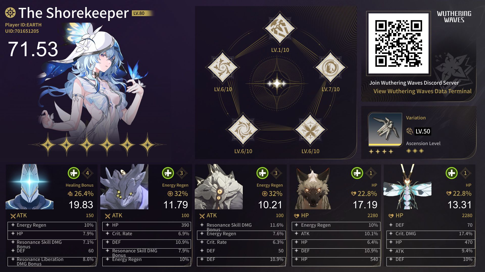

[](https://www.gnu.org/licenses/gpl-3.0)
# Wuthering Waves Echo Scorer

A python script to OCR analyze your Resonator’s echoes from image locally.\
_Assumes you have five Echoes equipped at +25._

---

## Prerequisites

- **Python** 3.10
- Tested on **Windows** (CUDA 12.6) and **Linux**  
- A screenshot of your Resonator’s profile

---

### Overview

#### 1. [Create a character profile from official discord](#1-create-a-character-profile-from-official-discord)

#### 2. [Clone this repo](#2-clone-this-repo)

#### 3. [Analyze](#3-analyze)

## 1. Create a character profile from the official Discord

1. Go to Discord

2. Search **Wuthering Waves Official** and join server

3. Find **#bot-command** channel

4. Change language to English

```
\language English
```

5. Bind Discord and Wuthering Waves
```
\bind
```
6. Create a character profile
```
\create
```
Then select the character you want to analyze

7. Move the image to input folder

## 2. Clone & Install

Tested on Python 3.10.6

1. Clone
```
git clone git@github.com:berniewu2/WutheringWavesEchoScorer.git
cd WutheringWavesEchoScorer
```
2. Move the image into the folder

3. Install dependency

```
# Windows + NVIDIA GPU + CUDA 12.6
python -m pip install paddlepaddle-gpu==3.0.0 -i https://www.paddlepaddle.org.cn/packages/stable/cu126/

pip install paddleocr
```

## 3. Analyze

#### Run the Scorer
By default it looks for all images in the input folder.
```
python main.py
```
Results will be in the output folder.

Example Rsult





#### Score

- 100: Perfect score
- 80 or above: Great
- 70 or above: Good
- 60 or above: OK
- Below 60: Trash

***Ok** echoes are fine for support or healer, but carry needs at least **good** echoes*
